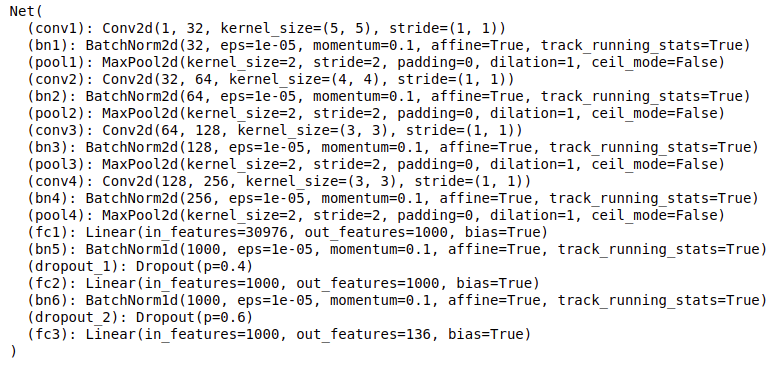
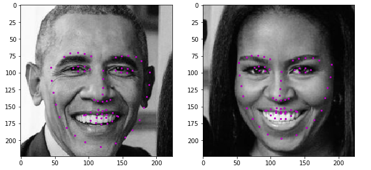

# Project - Facial Keypoint Detection

This project is all about defining and training a convolutional neural network to perform facial keypoint detection,
and using computer vision techniques to transform images of faces.

Facial keypoints (also called facial landmarks) are the small magenta dots shown on each of the faces in the image above. In each training and test image, there is a single face and 68 keypoints, with coordinates (x, y), for that face. These keypoints mark important areas of the face: the eyes, corners of the mouth, the nose, etc. These keypoints are relevant for a variety of tasks, such as face filters, emotion recognition, pose recognition, and so on. Here they are, numbered, and you can see that specific ranges of points match different portions of the face.

### 1) The Dataset

Images from the [youtube faces dataset](https://www.cs.tau.ac.il/~wolf/ytfaces/) has been used for training

Example Images:

Now, the images above are not of the same size, and neural networks often expect images that are standardized; a fixed size, with a normalized range for color ranges and coordinates, and (for PyTorch) converted from numpy lists and arrays to Tensors.

Therefore, four transforms are applied :

Normalize: to convert a color image to grayscale values with a range of [0,1] and normalize the keypoints to be in a range of about [-1, 1]

Rescale: to rescale an image to a desired size.

RandomCrop: to crop an image randomly.

ToTensor: to convert numpy images to torch images.

### 2) The Neural Network

Using this [paper](https://arxiv.org/pdf/1710.00977.pdf) as reference the following architecture was implemented .

### 3) Traning the Network

#### Question 1: What optimization and loss functions did you choose and why?¶
The problem here would be a regression ,to find the location of features.

LOSS :

L1smooth and MSEloss both would work well with Regression problems. I wanted to choose one based on some results.And both were showing almost similar results .so , I went with the simpler and Standard MSEloss

Optimizer :

Adam optimizer would work well with Regression problems.Therefore I went for it directly.But chose to experiment on the Learning Rate to optimize the training. Found the learning rate of 0.001 to work quite well

#### Question 2: What kind of network architecture did you start with and how did it change as you tried different architectures? Did you decide to add more convolutional layers or any layers to avoid overfitting the data?
I used https://arxiv.org/pdf/1710.00977.pdf this research paper as reference.

So I chose 4 Convolutional Layes followed by 3 Fully Connected layers for the architechture initially. But then I went to experiment with the Kernel Sizes in the Convolutional Layers to see what difference it makes.

The convolutional layers with decreasing filter sizes seemed to provide good results.

The overfitting seemed to be a problem with just these layers. So went on to add BatchNormalization after every layer and two dropout layers with the two fully connected layers(The first two FC layers).

#### Question 3: How did you decide on the number of epochs and batch_size to train your model?
batch_size :

Batch sizes of 32,64 ,128 and so on are recommended. I found 64 to be quite fast and also produced good results. So I stuck with that.

epochs :

I added code that would be saving the model with minimum average loss through any epoch .And chose 50 epochs to run , found the loss to saturate over that range ,So with the option to save only the model with the minimum loss,I went with 50 epochs

### 4) Results

The trained network was then tested on unseen images and here are the results :

